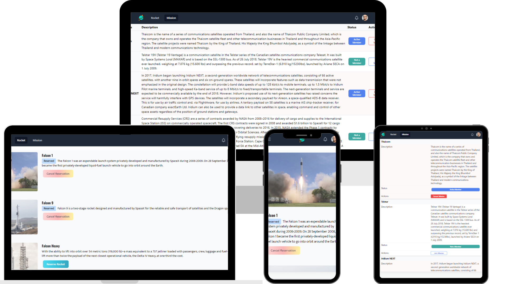

# SPACEX TRAVELLERS HUB

SpaceX Travellers Hub is a web application that fetches a package from an api, a missions and Rockets. a  traveller can reserve a rocket  and join a mission, incase of unsatisfactory you can cancel the rocket and re-reserve. joined mission status is showed as well as the rocket status. all reserved rockets and joined missions are displayed on the profile.

## Logo


## Screenshot


## Demo


## Run Locally

Clone the project

```bash
  git clone git@github.com:caasperr/SpaceX-Traveller-Hub.git
```

Go to the project directory

```bash
  cd SpaceX-Traveller-Hub
```

Install dependencies

```bash
  npm install
```

Start the server

```bash
  npx eslint . --fix
  npm run start
```


## Josphat Kiploman

- [@Github](https://github.com/Josphat205)

- [@Linkedin](https://www.linkedin.com/in/josphat-kiploman-797430236/)

## Waleed Amjad

- [@Github]('https://github.com/caasperr')

 
- [@Linkedin]('https://www.linkedin.com/in/developerwaleed/')


## 🤝 Contributing

Contributions, issues, and feature requests are welcome!

## Show your support

Give a ⭐ if you like this project!

## 📝 License

This project is [MIT](./MIT.md) licensed.


